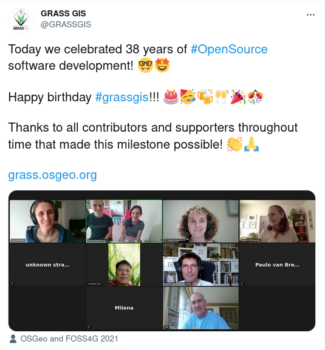
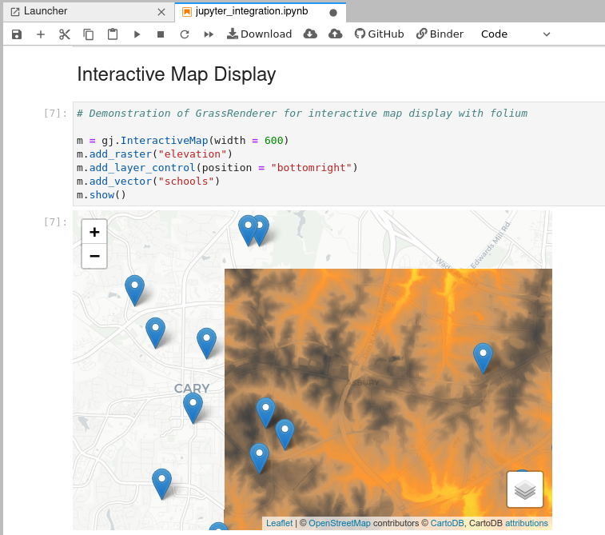
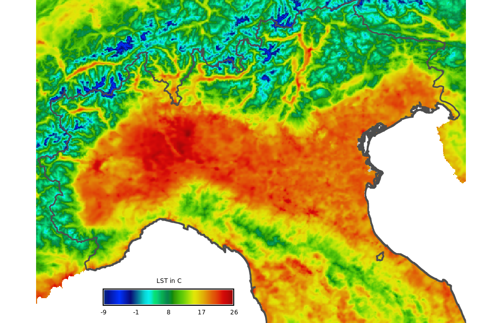
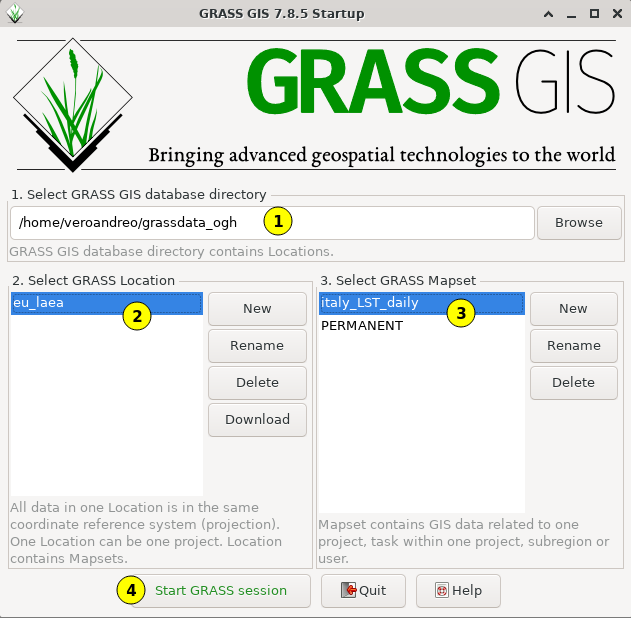
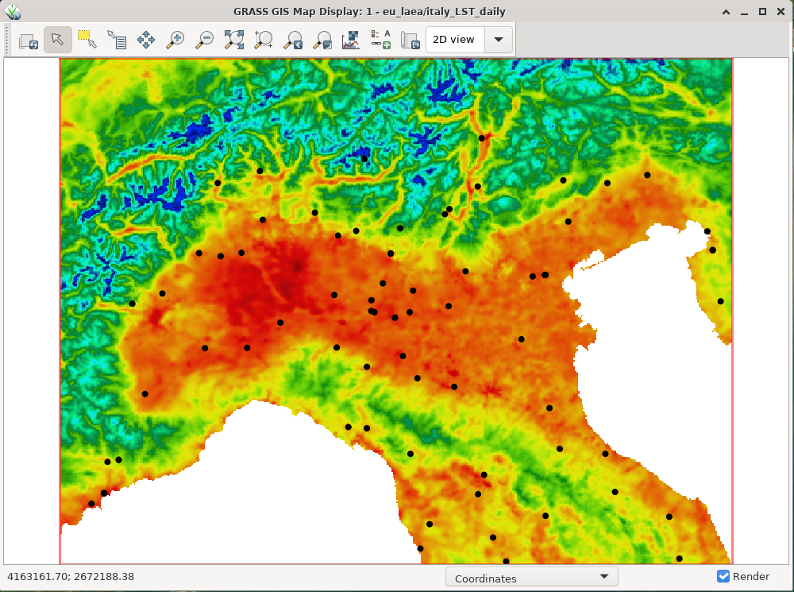
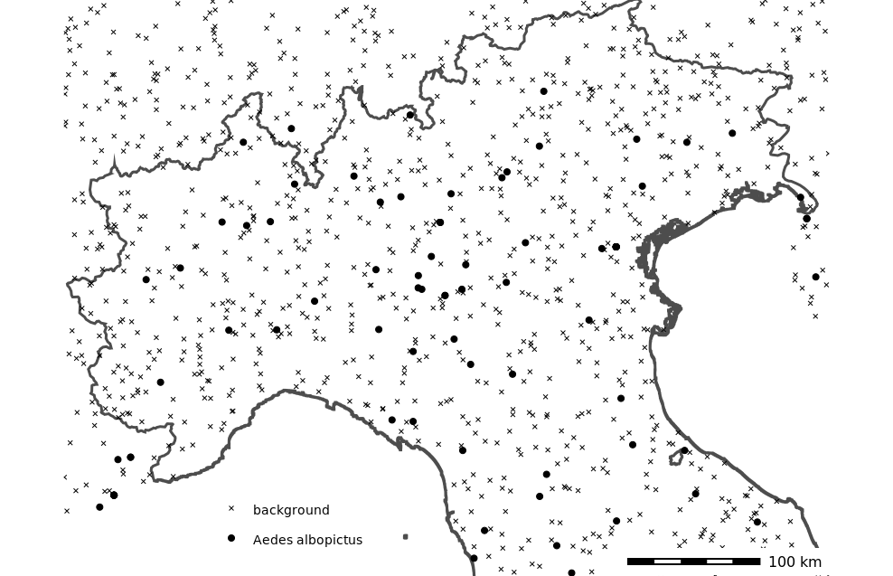
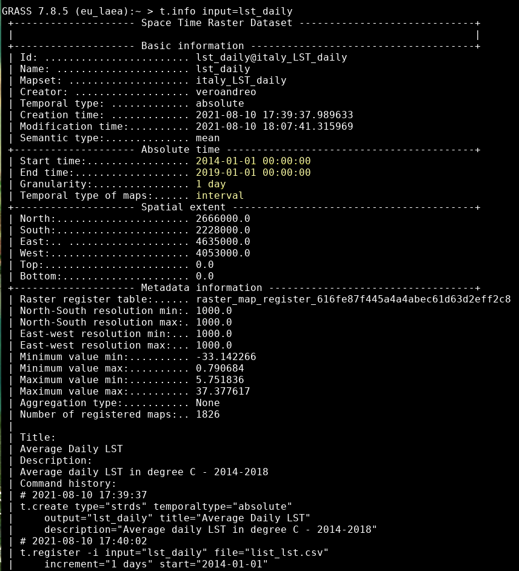
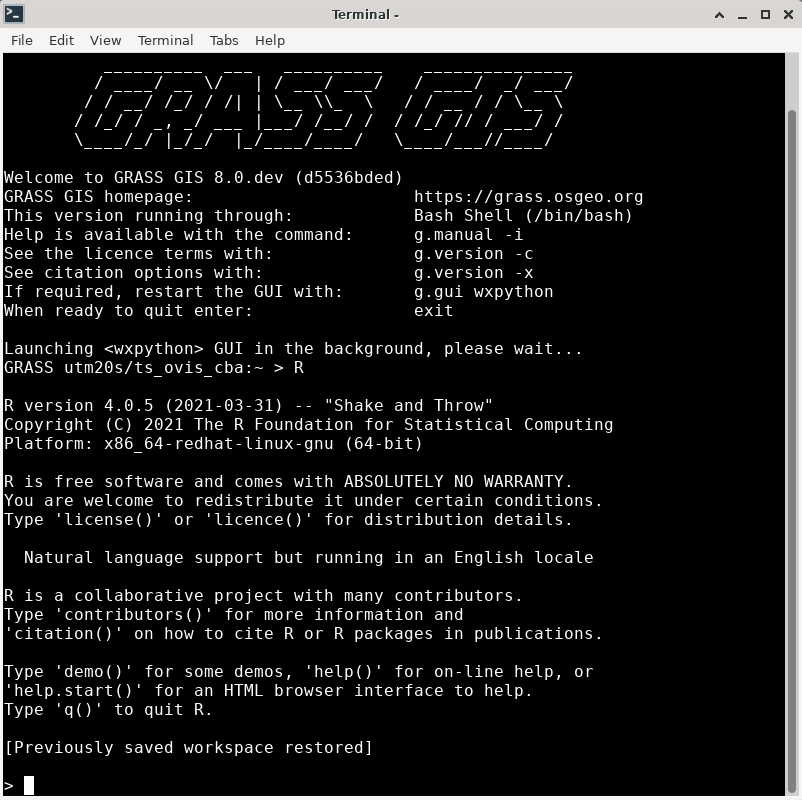
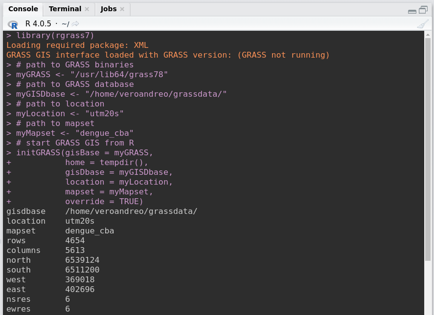

```{r setup, include=FALSE}
options(htmltools.dir.version = FALSE)
knitr::opts_chunk$set(
  fig.width=9, fig.height=6, fig.retina=3,
  out.width = "80%",
  cache = FALSE,
  echo = TRUE,
  message = FALSE, 
  warning = FALSE,
  hiline = TRUE
)
```

```{r libraries, include=FALSE}
library(fontawesome)
library(emo)
```

```{r xaringanExtra, echo=FALSE}
# https://github.com/gadenbuie/xaringanExtra
xaringanExtra::use_xaringan_extra("tile_view")
xaringanExtra::use_panelset()
xaringanExtra::use_logo(image_url = "https://grass.osgeo.org/images/logos/grasslogo.svg",
                        width = "40px")
xaringanExtra::use_fit_screen()
xaringanExtra::use_progress_bar(color = "#ee4912", location = "bottom", height = "3px")
```

---
class: grass-slide, hide_logo, center

## Analyzing space-time satellite data for disease ecology applications with GRASS GIS and R

#### Veronica Andreo

.message-box-white[
<br>


OpenGeoHub Summer School - September, 2021]

<!-- background-position: 0% 100%, 100% 0% -->
<!-- background-size: 30%, 10% -->
---
layout: false

## About the trainer

.pull-left-wide[
- PhD in Biology and MSc in Remote Sensing and GIS
- Researcher and lecturer at [Gulich Institute](https://ig.conae.unc.edu.ar/) from the  [Argentinean Space Agency - CONAE](https://www.argentina.gob.ar/ciencia/conae), working on applications of RS & GIS for disease ecology
- [GRASS GIS](https://grass.osgeo.org/) dev team and PSC Chair
- [OSGeo](https://www.osgeo.org/) Charter member
- [FOSS4G](https://2021.foss4g.org/) enthusiast and advocate]

.pull-right-narrow[
.bio-img[]

https://veroandreo.gitlab.io/
]

---

## What GRASS?

.pull-left-wide[
- **GRASS GIS** (Geographic Resources Analysis Support System), a FOSS suite used for geospatial data management and analysis, image processing, graphics and maps, spatial modeling, and visualization. 

- Originally developed by the U.S. Army Construction Engineering Research Laboratories  for land management and environmental planning (1982-1995).

- More history: https://grass.osgeo.org/about/history/]

.pull-right-narrow[
]

---
class: grass-slide center

A bit of (geek) GRASS GIS history...

<iframe width="560" height="315" scrolling="no" src="//av.tib.eu/player/12963" frameborder="0" allowfullscreen></iframe>

<br>
.message-box-white[
In case you didn't notice, the video is narrated by William Shatner `r emo::ji("nerd")`
]

---
class: grass-slide

## GRASS general stuff

- Open source, you can use, modify, improve, share
- Strong user community, commercial support
- Large amount of tools: 500+ core modules, 400+ addons
- GUI and CLI (easy for scripting) interfaces
- Python API and libraries
- Connection with R, QGIS, WPS, etc.
- Different data types supported: [raster](https://grass.osgeo.org/grass-stable/manuals/rasterintro.html) (including [satellite imagery](https://grass.osgeo.org/grass-stable/manuals/imageryintro.html)), [3D raster or voxel](https://grass.osgeo.org/grass-stable/manuals/raster3dintro.html), [vector](https://grass.osgeo.org/grass-stable/manuals/vectorintro.html) (point, line, boundary, area, face) and [space-time datasets](https://grass.osgeo.org/grass-stable/manuals/temporalintro.html) 

---

### `r fa("tools")` More than [500 core  modules](https://grass.osgeo.org/grass-stable/manuals/full_index.html) `r fa("tools")`

| Prefix                                                               | Function class   | Type of command                     | Example
|--------------------------------------------------------------------- |:---------------- |:----------------------------------- |:-------------------------------------------------------------------------------------------------------------------
| [g.\*](https://grass.osgeo.org/grass-stable/manuals/full_index.html#g)    | general          | general data management             | [g.rename](https://grass.osgeo.org/grass-stable/manuals/g.rename.html): renames map
| [d.\*](https://grass.osgeo.org/grass-stable/manuals/full_index.html#d)    | display          | graphical output                    | [d.rast](https://grass.osgeo.org/grass-stable/manuals/d.rast.html): display raster map 
| [r.\*](https://grass.osgeo.org/grass-stable/manuals/full_index.html#r)    | raster           | raster processing                   | [r.mapcalc](https://grass.osgeo.org/grass-stable/manuals/r.mapcalc.html): map algebra
| [v.\*](https://grass.osgeo.org/grass-stable/manuals/full_index.html#r)    | vector           | vector processing                   | [v.clean](https://grass.osgeo.org/grass-stable/manuals/v.clean.html): topological cleaning
| [i.\*](https://grass.osgeo.org/grass-stable/manuals/full_index.html#i)    | imagery          | imagery processing                  | [i.pca](https://grass.osgeo.org/grass-stable/manuals/i.pca.html): Principal Component Analysis
| [r3.\*](https://grass.osgeo.org/grass-stable/manuals/full_index.html#r3)  | voxel            | 3D raster processing                | [r3.stats](https://grass.osgeo.org/grass-stable/manuals/r3.stats.html): voxel statistics
| [db.\*](https://grass.osgeo.org/grass-stable/manuals/full_index.html#db)  | database         | database management                 | [db.select](https://grass.osgeo.org/grass-stable/manuals/db.select.html): select value(s) from table
| [ps.\*](https://grass.osgeo.org/grass-stable/manuals/full_index.html#ps)  | postscript       | PostScript map creation             | [ps.map](https://grass.osgeo.org/grass-stable/manuals/ps.map.html): PostScript map creation
| [t.\*](https://grass.osgeo.org/grass-stable/manuals/full_index.html#t)    | temporal         | space-time datasets                 | [t.rast.aggregate](https://grass.osgeo.org/grass-stable/manuals/t.rast.aggregate.html): raster time series aggregation

---
class: grass-slide

## `r fa("tools")` More than [300 add-ons](https://grass.osgeo.org/grass-stable/manuals/addons/) `r fa("tools")`

Plugins or **Add-ons** can be installed from
a centralized [OSGeo repository](https://grass.osgeo.org/grass-stable/manuals/addons/) 
or from github (or similar repositories) using 
[g.extension](https://grass.osgeo.org/grass-stable/manuals/g.extension.html) command.

```bash
# install extension from GRASS GIS Add-on repository
g.extension extension=r.hants
 
# install extension from github repository
g.extension extension=r3.slice \
  url=https://github.com/petrasovaa/r3.slice
``` 

---
class: grass-slide, hide_logo, center

# Different interfaces

GRASS GIS offers different interfaces for the interaction between user and software. 

#### Let's see some of them!

---
layout: true

### Graphical User Interface (GUI)

---

.left-column[
GRASS 7+
]

.right-column[

]

---

.left-column[
GRASS 8
]

.right-column[

]

---

.left-column[
GRASS 8+

Upcoming...
]

.right-column[

]

---
layout: false

### `r fa("terminal")` Command line 

<center></center>

---
layout: true

### `r fa("python")` Python 

---

- 2 libraries delivered with GRASS GIS: **grass** and **pygrass**, that provide access to modules and internal C functions
- 1 external library: [**grass-session**](https://github.com/zarch/grass-session) that can be installed with `pip`

<center></center>

---

... or write your Python script and run it from CLI or GUI:

```python
#!/usr/bin/env python

# simple example for pyGRASS usage: raster processing via modules approach
from grass.pygrass.modules.shortcuts import general as g
from grass.pygrass.modules.shortcuts import raster as r
g.message("Filter elevation map by a threshold...")
 
# set computational region
input = 'elevation'
g.region(raster=input)
output = 'elev_100m'
thresh = 100.0

r.mapcalc("%s = if(%s > %d, %s, null())" % (output, input, thresh, input), overwrite = True)
r.colors(map=output, color="elevation")
``` 
---

... or in Jupyter Lab/notebooks via `grass.jupyter`: a new library under development by a GSoC student

.center[
]

---

### Try GRASS GIS online: [Binder](https://mybinder.org/) + Jupyter

.center[
<a href="https://github.com/wenzeslaus/try-grass-in-jupyter"></a>

Just click over **launch** button!
]

---
layout: true

### QGIS

---

.right-column[

]

.left-column[
[GRASS GIS plugin](https://docs.qgis.org/3.16/en/docs/user_manual/grass_integration/grass_integration.html)
]

---

.right-column[

]

.left-column[
[Processing toolbox](https://docs.qgis.org/3.16/en/docs/user_manual/processing/toolbox.html)
]

---
layout: false

### GRASS + `r fa("r-project", fill="#276dc2")` through rgrass7 package

We can use [R within a GRASS GIS session](https://grasswiki.osgeo.org/wiki/R_statistics/rgrass7#R_within_GRASS) or use [GRASS GIS within an R session](https://grasswiki.osgeo.org/wiki/R_statistics/rgrass7#GRASS_within_R)

<center></center>

---
class: grass-slide center

# Temporal support in GRASS GIS: TGRASS

---

## The TGRASS framework

.left[GRASS GIS is **the first FOSS GIS** that incorporated capabilities to **manage, analyze, process and visualize spatio-temporal data**, as well as the temporal relationships among time series.]

- TGRASS is fully **based on metadata** and does not duplicate any dataset
- Snapshot approach, i.e., adds time stamps to maps
- A collection of time stamped maps (snapshots) of the same variable are called space-time datasets or STDS
- Maps in a STDS can have different spatial and temporal extents

---
class: grass-slide

## Space-time datasets

- Space time raster datasets (**STRDS**)
- Space time 3D raster datasets (**STR3DS**)
- Space time vector datasets (**STVDS**)

<br>
> `r emo::ji("announcement")` GRASS 8 supports image collections by adding a band reference

---
class: grass-slide

## Temporal modules

- **t.\***: General modules to handle STDS of all types
- **t.rast.\***: Modules that deal with STRDS
- **t.rast3d.\***: Modules that deal with STR3DS
- **t.vect.\***: Modules that deal with STVDS

---

### Other TGRASS notions

.pull-left[
- Time can be defined as **intervals** (start and end time) or **instances** (only start time)
- Time can be **absolute** (e.g., 2017-04-06 22:39:49) or **relative** (e.g., 4 years, 90 days)
- **Granularity** is the greatest common divisor of the temporal extents (and possible gaps) of all maps in the space-time cube]

.pull-right[
- **Topology** refers to temporal relations between time intervals in a STDS.


]

---

.left-column[
### TGRASS:
#### framework and workflow]

.right-column[]

---
class: grass-slide center middle

## Hands-on to space-time analysis for disease ecology with GRASS GIS and `r fa("r-project", fill="#276dc2", width = "2em")` 

---
class: grass-slide

### Overview

Habitat suitability mapping for the Asian tiger mosquito in Northern Italy

.pull-left[
- GRASS
  - Import species records
  - Create random background points
  - Create different environmental layers from LST daily data
]

.pull-right[
- R
  - Read data from GRASS into R
  - Model species distribution
  - Model evaluation 
  - Visualization of results
]

---

### Data for the session

.pull-left[
- Records of *Aedes albopictus* (Asian tiger mosquito) in Northern Italy downloaded from [GBIF](https://www.gbif.org/)
- Environmental layers derived from LST
  - MODIS LST reconstructed by [mundialis](https://www.mundialis.de/en/) based on [Metz et al. 2017](https://www.mdpi.com/2072-4292/9/12/1333/htm)
  - Daily average LST
  - 1 km spatial resolution
  - Converted to Celsius degrees
]

.pull-right[

<br>

]

---

### `r fa("download")` Get sample location, mosquito records and code `r fa("download")`

- Create a folder named `grassdata_ogh`
- Download and unzip [eu_laea location with LST mapset]() and unzip within your `grassdata_ogh` folder
- Download asian tiger [mosquito occurrences]() as `.gpkg` file
- Download [GRASS script]()
- Download [R script]()

Your folder's tree should look like:
```
  grassdata_ogh/
  └── eu_laea
      ├── italy_LST_daily
      └── PERMANENT
```
<!-- arreglar los links -->

---

.left-column[
## Let's start GRASS GIS!

### Fear not!
`r emo::ji("surprised")`
]

.right-column[
.center[

`r emo::ji("announcement")` This start-up screen is gone in GRASS 8 
]
]

---

## Basic notions: <a href="https://grass.osgeo.org/grass76/manuals/grass_database.html">GRASS database</a>

.pull-left[
- The **GRASS DATABASE** (or "GISDBASE") is an existing directory containing all GRASS GIS LOCATIONs. 
- A **LOCATION** is defined by its coordinate system and geographical boundaries.
- **MAPSET** is a subdirectory within Locations. In a **MAPSET** you can organize GIS maps thematically, geographically, by project, etc.
- When GRASS GIS starts, it connects to `Database/Location/Mapset`:
]

.pull-right[


]

---

## Basic notions: <a href="https://grass.osgeo.org/grass76/manuals/grass_database.html">GRASS database</a>

- **Why this structure?**

 - GRASS GIS has a *native format* for raster and vector data, therefore
   they must be *imported* or *linked* into a GRASS Location/Mapset.

- **What are the advantages?**

 - GRASS DATABASE, LOCATIONs and MAPSETs are folders that *can be easily shared with other users*.
 - The GRASS DATABASE can be *local or remote*, and *special permissions* can be set to specific mapsets in a LOCATION.
 - All data in a LOCATION have necessarily the same CRS.

---

## Basic notions: [Computational region](https://grasswiki.osgeo.org/wiki/Computational_region)


---

## Basic notions: [Computational region](https://grasswiki.osgeo.org/wiki/Computational_region)

.pull-left[
The **computational region** is defined by the *bounding box and resolution* (for raster and 3D raster maps).

It can be set and changed by means of [g.region](https://grass.osgeo.org/grass-stable/manuals/g.region.html) to the extent of a vector map, a raster map or manually to some area of interest (subset). 

*Output rasters* will have their extent and resolution equal to the current region.
]

.pull-right[
- **Advantages**

  - Keep your results consistent
  - Avoid clipping maps prior to subarea analysis
  - Test an algorithm or computationally demanding process in small areas
  - Fine-tune the settings of a certain module
  - Run different processes in different areas
]

---
class: grass-slide center

# Now we are ready to start
<!-- add emoji here -->

---

#### Importing species records

.panelset[
.panel[.panel-name[Code]

```bash
# Import records
v.import input=aedes_albopictus.gpkg \
  output=aedes_albopictus

# List raster maps
g.list type=raster
r.colors map=lst_2014.150_avg \
  color=celsius

# Display records
d.mon wx0
d.rast lst_2014.150_avg
d.vect aedes_albopictus icon=basic/circle \
  size=7 fill_color=black
```
]

.panel[.panel-name[Plot]
.center[]
]
]

---
class: middle

If you'd need to start from scratch:

```bash
# Set computational region
g.region -p raster=lst_2014.001_avg

# Install extension 
# requires pygbif: `pip install pygbif`
g.extension extension=v.in.pygbif

# Import data from GBIF
v.in.pygbif output=aedes_albopictus \
  taxa="Aedes albopictus" \
  date_from="2014-01-01" \
  date_to="2018-12-31" 
```

.footnote[Check [v.in.pygbif](https://grass.osgeo.org/grass-stable/manuals/addons/v.in.pygbif.html) for further options, eg., `mask`]

---

#### Creating random background points

.panelset[
.panel[.panel-name[Code]

```bash
# Create buffer around Aedes albopictus records
v.buffer input=aedes_albopictus \
  output=aedes_buffer distance=2000
  
# Create a vector mask to limit background points
r.mapcalc expression="rast_mask = if(lst_2014.001_avg, 1, null())"
r.to.vect input=rast_mask output=vect_mask type=area

# Subtract buffers from vector mask
v.overlay ainput=vect_mask binput=aedes_buffer \
  operator=xor output=mask_background

# Generate random background points
v.random output=background_points npoints=1000 \
  restrict=mask_background seed=3749
```
]

.panel[.panel-name[Plot]
.center[]
]
]

---

#### Create daily LST STRDS

.panelset[
.panel[.panel-name[Code]

```bash
# Create time series 
t.create type=strds temporaltype=absolute \
  output=lst_daily title="Average Daily LST" \
  description="Average daily LST in degree C - 2014-2018"

# Get list of maps 
g.list type=raster pattern="lst_201*" output=list_lst.csv

# Register maps in strds  
t.register -i input=lst_daily file=list_lst.csv \
  increment="1 days" start="2014-01-01"

# Get info about the strds
t.info input=lst_daily
```
]

.panel[.panel-name[Output]
.center[]
]
]

---

### Generate environmental variables from LST STRDS

#### Long term monthly avg, min and max LST

```bash
for i in $(seq -w 1 12) ; do 
  t.rast.series input=lst_daily method=average \
    where="strftime('%m', start_time)='${i}'" \
    output=lst_average_${i}
    
  t.rast.series input=lst_daily method=minimum \
    where="strftime('%m', start_time)='${i}'" \
    output=lst_minimum_${i}
    
  t.rast.series input=lst_daily method=maximum \
    where="strftime('%m', start_time)='${i}'" \
    output=lst_maximum_${i}  
done

```

.footnote[See [t.rast.series]() manual for further details]

---

#### Bioclimatic variables

```bash
# Install extension
g.extension extension=r.bioclim
 
# Estimate temperature related bioclimatic variables
r.bioclim \
  tmin=$(g.list type=raster pattern="lst_minimum_??" separator=",") \
  tmax=$(g.list type=raster pattern="lst_maximum_??" separator=",") \
  tavg=$(g.list type=raster pattern="lst_average_??" separator=",") \
  output=worldclim_ 

# List output maps
g.list type=raster pattern="worldclim*"
```

.footnote[See [r.bioclim]() manual for further details]

---

#### Spring warming

```bash
# Annual spring warming: slope(daily Tmean february-march-april)
t.rast.aggregate input=lst_daily output=annual_spring_warming \
  basename=spring_warming suffix=gran \
  method=slope granularity="1 years" \
  where="strftime('%m',start_time)='02' or \
         strftime('%m',start_time)='03' or \
         strftime('%m', start_time)='04'"

# Average spring warming
t.rast.series input=annual_spring_warming \
  output=avg_spring_warming \
  method=average
```
<!-- add screenshot -->
.footnote[See [t.rast.aggregate]() manual for further details]

---

#### Autumnal cooling

```bash
# Annual autumnal cooling: slope(daily Tmean august-september-october)
t.rast.aggregate input=lst_daily output=annual_autumnal_cooling \
  basename=autumnal_cooling suffix=gran \
  method=slope granularity="1 years" \
  where="strftime('%m',start_time)='08' or \
         strftime('%m',start_time)='09' or \
         strftime('%m', start_time)='10'"

# Average autumnal cooling
t.rast.series input=annual_autumnal_cooling \
  output=avg_autumnal_cooling \
  method=average
```
<!-- add screenshot -->
---

#### Number of days with LSTmean >= 20 and <= 30

```bash
# Keep only pixels meeting the condition
t.rast.algebra -n \
  expression="tmean_higher20_lower30 = if(lst_daily >= 20.0 && lst_daily <= 30.0, 1, null())" \
  basename=tmean_higher20_lower30 suffix=gran nproc=7

# Count how many times per year the condition is met
t.rast.aggregate input=tmean_higher20_lower30 \
  output=count_tmean_higher20_lower30 \
  basename=tmean_higher20_lower30 suffix=gran \
  method=count granularity="1 years"

# Average number of days with LSTmean >= 20 and <= 30
t.rast.series input=count_tmean_higher20_lower30 \
  output=avg_count_tmean_higher20_lower30 method=average
```

.footnote[See [t.rast.algebra]() manual for further details]

---
layout: true

#### Number of consecutive days with LSTmean <= -2.0

---

```bash
# Create annual mask
t.rast.aggregate input=lst_daily output=annual_mask \
  basename=annual_mask suffix=gran \
  granularity="1 year" method=count

# Replace values by zero
t.rast.mapcalc input=annual_mask output=annual_mask_0 \
  expression="if(annual_mask, 0)" \
  basename=annual_mask_0

# Calculate consecutive days with LSTmean <= -2.0
t.rast.algebra \
  expression="lower_m2_consec_days = annual_mask_0 {+,contains,l} \
  if(lst_daily <= -2.0 && lst_daily[-1] <= -2.0 || \
  lst_daily[1] <= -2.0 && lst_daily <= -2.0, 1, 0)" \
  basename=lower_m2_ suffix=gran nproc=7
```

---

```bash
# Inspect values
t.rast.list input=lower_m2_consec_days \
  columns=name,start_time,end_time,min,max

# Median number of consecutive days with LSTmean >= 33
t.rast.series input=lower_m2_consec_days \
  output=median_lower_m2_consec_days method=median
```
<!-- add screenshot -->

---
layout: false
class: grass-slide

## We have all these maps in GRASS, how do we connect with R now?

<!-- add emoji -->
---

## [**rgrass7**](https://cran.r-project.org/web/packages/rgrass7/index.html)

- `initGRASS()`: starts a GRASS GIS session from R
- `execGRASS()`: executes GRASS GIS commands
- `gmeta()`: shows GRASS location metadata
- `readVECT()` and `readRAST()`: read vector and raster maps from GRASS into *sf* or *sp* objects 
- `writeVECT()` and `writeRAST()`: write *sf* or *sp* objects into GRASS GIS database


.footnote[`r emo::ji("announcement")` Volunteers needed!!

---
layout: true

### GRASS GIS and `r fa("r-project", fill="#276dc2")` can be used together in two ways:

---

.pull-left[
A. Using [R within a GRASS GIS session](https://grasswiki.osgeo.org/wiki/R_statistics/rgrass7#R_within_GRASS), i.e. starting R (or RStudio) from the GRASS GIS terminal
<br>
  - type `R` or `rstudio &` in the GRASS GIS terminal
  - load `rgrass7` library
  - use `readVECT()`, `readRAST()` to read data from GRASS into R
  - access GRASS GIS funtionalities and database through `execGRASS()`
  - write data (back) to GRASS database with `writeVECT()` and `writeRAST()`
]

.pull-right[

]

---

.pull-left[
B. Using [GRASS GIS within an R session](https://grasswiki.osgeo.org/wiki/R_statistics/rgrass7#GRASS_within_R), i.e. we connect to GRASS GIS database from within R (or RStudio).
<br>
  - we need to start GRASS GIS with `initGRASS()` 
  - we access GRASS GIS funtionalities through `execGRASS()` 

> Originally intended to apply GRASS functions on data outside GRASS DB; hence some prefer to create throw away locations
]

.pull-right[

]

---
layout: false

# Let's move to `r fa("r-project", fill="#276dc2")`

---

#### Option 2: Close GRASS, open Rstudio and run:

```{r message=FALSE}
library(rgrass7)

# path to GRASS binaries
myGRASS <- "/usr/lib64/grass78"
# path to GRASS database
myGISDbase <- "/home/veroandreo/grassdata_ogh/"
# path to location
myLocation <- "eu_laea"
# path to mapset
myMapset <- "italy_LST_daily"

# start GRASS GIS from R
initGRASS(gisBase = myGRASS, home = tempdir(), gisDbase = myGISDbase, 
          location = myLocation, mapset = myMapset, override = TRUE)
```

<!-- poner paneles -->

---
### Within R...

#### Load other packages

```{r load_libraries}
library(raster)
library(sf)
library(mapview)
library(biomod2)
```

---
layout: true

#### Read vector data

---

```{r read_vectors, message=FALSE, warning=FALSE, results='hide'}
# Use sf for vectors
use_sf()

# Read vector layers
Aa_pres <- readVECT("aedes_albopictus")
background <- readVECT("background_points")
```

---

```{r plot_vectors, message=FALSE, warning=FALSE}
# Quick visualization in mapview
mapview(Aa_pres) + mapview(background, color="black", col.regions="black", cex=2)
```

---
layout: true 

#### Read raster data

---

```{r read_rasters, message=FALSE, warning=FALSE, results='hide', eval=FALSE}
# Use sp for rasters
use_sp()

# List rasters by pattern
worldclim <- execGRASS("g.list", parameters = list(type = "raster", pattern = "worldclim*"))
avg <- execGRASS("g.list", parameters = list(type = "raster", pattern = "avg*"))
median <- execGRASS("g.list", parameters = list(type = "raster", pattern = "median*", exclude = "*[1-5]"))

# Concatenate map lists
to_import <- c(attributes(worldclim)$resOut, 
               attributes(avg)$resOut, 
               attributes(median)$resOut)

# Read raster layers
predictors <- list()
for (i in to_import){ predictors[i] <- raster(readRAST(i)) }
```

---

```{r quick_view, message=FALSE, warning=FALSE}
# Quick visualization in mapview
mapview(predictors[['worldclim_bio01']]) + Aa_pres
```

---
layout: false

#### Data preparation and formatting

```{r data_prep1, message=FALSE, warning=FALSE, results='hide'}
# Response variable
n_pres <- dim(Aa_pres)[1]
n_backg <- dim(background)[1]
spp_name <- 'Aedes.albopictus'

pres <- rep(1, n_pres)
backg <- rep(0, n_backg)
myResp <- c(pres, backg)

myRespXY <- rbind(st_coordinates(Aa_pres),
		          st_coordinates(background))
```

---

#### Data preparation and formatting

```{r data_prep2, message=FALSE, warning=FALSE, results='hide'}
# Explanatory variables
# Stack raster layers
myExpl <- raster::stack(predictors)

# All together
myBiomodData <- BIOMOD_FormatingData(resp.var = myResp,
                                     expl.var = myExpl,
                                     resp.xy = myRespXY,
                                     resp.name = spp_name)
```

---

#### Run model

```{r model_setting, message=FALSE, warning=FALSE, results='hide'}
# Set options
myBiomodOption <- BIOMOD_ModelingOptions(
  MAXENT.Phillips = 
    list(path_to_maxent.jar = "/home/veroandreo/software/maxent/maxent.jar",
         lq2lqptthreshold = 100,
         l2lqthreshold = 100))
```

---

#### Run model

```{r model_run, message=FALSE, warning=FALSE, results='hide', eval=FALSE}
# Run model
myBiomodModelOut <- BIOMOD_Modeling(
  myBiomodData,
  models = c('MAXENT.Phillips'),  
  models.options = myBiomodOption,
  NbRunEval=3,     
  DataSplit=80,
  VarImport=10,
  models.eval.meth = c('ROC','ACCURACY'),
  SaveObj = TRUE,
  rescal.all.models = FALSE,
  do.full.models = FALSE,
  modeling.id = paste(spp_name,"Habitat_Suitability",sep="_"))

# Inspect the model
myBiomodModelOut
```

---

#### Model evaluation

```{r model_eval, message=FALSE, warning=FALSE, results='hide'}
# Extract evaluation data
myBiomodModelEval <- get_evaluations(myBiomodModelOut)

# Accuracy
myBiomodModelEval["ACCURACY","Testing.data",,,]

# ROC: Receiver-operator curve
myBiomodModelEval["ROC","Testing.data",,,]

# Variable importance
get_variables_importance(myBiomodModelOut)
```

---

#### Model predictions

```{r model_projection, message=FALSE, warning=FALSE, results='hide'}
# Set parameters for model projection
myBiomodProj <- BIOMOD_Projection(
                modeling.output = myBiomodModelOut, 
                new.env = myExpl,                     
                proj.name = "current", 
                selected.models = "all", 
                compress = FALSE, 
                build.clamping.mask = FALSE)

# Obtain predictions
mod_proj <- get_predictions(myBiomodProj)
mod_proj
```
<!-- hacer paneles -->
---

#### Model predictions

```{r plot_model_proj, message=FALSE, warning=FALSE}
# Plot predicted model
plot(mod_proj)
```

---

#### Optionally, write data back to GRASS GIS

```{r write_raster_grass, message=FALSE, warning=FALSE, results='hide', eval=FALSE}
# Export only one layer
g <- as(mod_proj[[2]], 'SpatialGridDataFrame')
writeRAST(g, "maxent_albopictus", flags = "overwrite")

# Export all MaxEnt runs
for(i in seq_along(1:length(mod_proj@layers))){
  writeRAST(as(mod_proj[[i]], 'SpatialGridDataFrame'), 
            paste0("maxent_albopictus_", i, sep=""), 
            flags = "overwrite")
}

# Check it's there
execGRASS("g.list", parameters = list(type = "raster", pattern = "maxent*"))
```

---
class: center, middle


---

# GRASS GIS HELP!!! `r emo::ji("help")`

- [g.manual](https://grass.osgeo.org/grass76/manuals/g.manual.html):
  in the main GUI under Help or just pressing *F1*
- `--help` or `--h` flag after the module name in the terminal
- [GRASS website](https://grass.osgeo.org/): rich [learn](https://grass.osgeo.org/learn/) section with links to videos, tutorials, courses, books, etc.
- [GRASS wiki](https://grasswiki.osgeo.org/wiki/GRASS-Wiki): examples,
  explanations and help on particular modules or tasks,
  [tutorials](https://grasswiki.osgeo.org/wiki/Category:Tutorial),
  applications, etc.
- grass-user mailing list: [subscribe](https://lists.osgeo.org/mailman/listinfo/grass-user) and post or check the [archives](https://lists.osgeo.org/pipermail/grass-user/)
- Link to source code and history in each module manual page, eg., 
[t.rast.algebra](https://grass.osgeo.org/grass-stable/manuals/t.rast.algebra.html)

.center[]

---

## `r emo::ji("link")` Other (very) useful links

- [GRASS intro workshop held at NCSU](https://ncsu-osgeorel.github.io/grass-intro-workshop/)
- [Unleash the power of GRASS GIS at US-IALE 2017](https://grasswiki.osgeo.org/wiki/Unleash_the_power_of_GRASS_GIS_at_US-IALE_2017)
- [GRASS GIS course in Jena 2018](http://training.gismentors.eu/grass-gis-workshop-jena-2018/index.html)
- [Temporal data processing wiki](https://grasswiki.osgeo.org/wiki/Temporal_data_processing)
- [GRASS GIS and R for time series processing wiki](https://grasswiki.osgeo.org/wiki/Temporal_data_processing/GRASS_R_raster_time_series_processing)
- [GRASS GIS temporal workshop at NCSU](http://ncsu-geoforall-lab.github.io/grass-temporal-workshop/)
- [GRASS GIS workshop held in Jena 2018](http://training.gismentors.eu/grass-gis-workshop-jena-2018/index.html)
- [GRASS GIS course IRSAE 2018](http://training.gismentors.eu/grass-gis-irsae-winter-course-2018/index.html)
- [GRASS GIS course in Argentina 2018](https://gitlab.com/veroandreo/curso-grass-gis-rioiv)

---

## `r emo::ji("book")` References 

- Neteler, M., Mitasova, H. (2008): *Open Source GIS: A GRASS GIS Approach*. Third edition. ed. Springer, New York. [Book site](https://grassbook.org/)
- Neteler, M., Bowman, M.H., Landa, M. and Metz, M. (2012): *GRASS GIS: a multi-purpose Open Source GIS*. Environmental Modelling & Software, 31: 124-130 [DOI](http://dx.doi.org/10.1016/j.envsoft.2011.11.014)
- Gebbert, S., Pebesma, E. (2014). *A temporal GIS for field based environmental modeling*. Environmental Modelling & Software, 53, 1-12. [DOI](https://doi.org/10.1016/j.envsoft.2013.11.001)
- Gebbert, S., Pebesma, E. (2017). *The GRASS GIS temporal framework*. International Journal of Geographical Information Science 31, 1273-1292. [DOI](http://dx.doi.org/10.1080/13658816.2017.1306862)
- Gebbert, S., Leppelt, T. and Pebesma, E. (2019). *A Topology Based Spatio-Temporal Map Algebra for Big Data Analysis*. Data, 4, 86. [DOI](https://doi.org/10.3390/data4020086)

---
class: center hide_logo

# Thanks!!


`r fa("github")` <a href="https://github.com/veroandreo/">veroandreo</a> 
`r fa("twitter")` <a href="https://twitter.com/VeronicaAndreo">@VeronicaAndreo</a>

`r fa("globe")` https://veroandreo.gitlab.io/


---
class: center bottom

Slides created via the R packages:

[xaringan](https://github.com/yihui/xaringan)<br>
[xaringanExtra]()<br>
[gadenbuie/xaringanthemer](https://github.com/gadenbuie/xaringanthemer)
